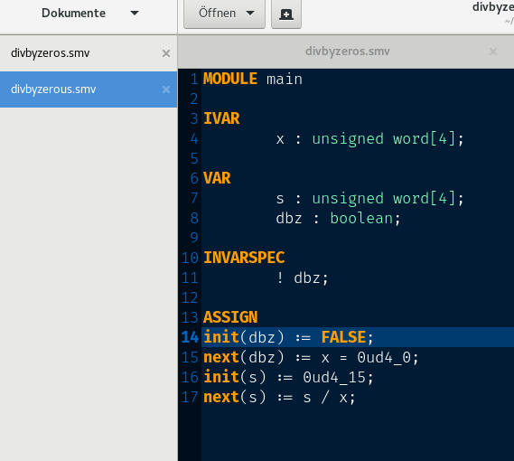

# gedit-smv

gedit language support for SMV format (Symbolic Model Verifier) 

You can find a description of the SMV format in the [nuXmv](https://es-static.fbk.eu/tools/nuxmv/index.php?n=Documentation.Home) and [nusmv](http://nusmv.fbk.eu/NuSMV/userman/index-v2.html) manuals. 




## Install

Put `SMV.lang` into `$HOME/.local/share/gtksourceview-3.0/language-specs/
`

```
curl https://raw.githubusercontent.com/wadoon/gedit-smv/master/install.sh | sh -
```
